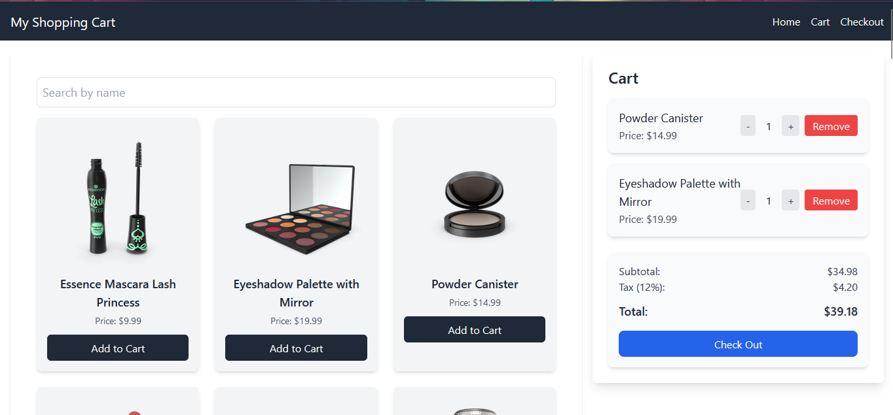

# Shopping Cart

## Description
A simple and efficient shopping cart application built with React and Vite. This app enables users to browse products, add items to a cart, view a cart summary, and proceed to checkout.

## Features
- **Product Search**: Search for products by name to quickly find what you need.
- **Add to Cart**: Add selected products to your shopping cart.
- **Cart Management**: Adjust the quantity of items in your cart.
- **Detailed Cart Summary**: View a summary with subtotal, tax, and total calculations.
- **Checkout**: Complete your purchase with a simple checkout process.

## Getting Started

Follow these instructions to set up and run the project on your local machine.

### Prerequisites
Ensure you have [Node.js](https://nodejs.org/) and npm installed on your machine.

### Installation

1. **Clone the repository**:
    ```bash
    git clone https://github.com/YourUsername/shopping-cart.git
    ```

2. **Navigate to the project directory**:
    ```bash
    cd shopping-cart
    ```

3. **Install dependencies**:
    ```bash
    npm install
    ```

4. **Run the project**:
    ```bash
    npm run dev
    ```
    This will start the Vite development server. Open your browser and go to [http://localhost:5173](http://localhost:5173) to view the application.


## Libraries and Tools Used

| Library / Tool      | Description                                |
|---------------------|--------------------------------------------|
| Vite                | Fast frontend build tool                   |
| React               | JavaScript library for building user interfaces |
| React Router DOM    | Declarative routing for React applications |
| Tailwind CSS        | Utility-first CSS framework for styling    |

## Project Structure

```plaintext
src
├── App.jsx           # Main component for the application
├── main.jsx          # Application entry point and Vite configuration
├── components        # Folder containing reusable components
│   ├── Cart.jsx           # Component displaying items in the cart
│   ├── CartItem.jsx       # Component for individual items in the cart
│   ├── Header.jsx         # Header component with navigation links
│   ├── ProductItem.jsx    # Component for displaying details of a product
│   └── ProductList.jsx    # Component for displaying the list of products
├── pages             # Folder for main application pages
│   ├── CheckoutPage.jsx   # Checkout page
│   └── HomePage.jsx       # Home page displaying products
└── assets            # Folder to store static images or icons
```


